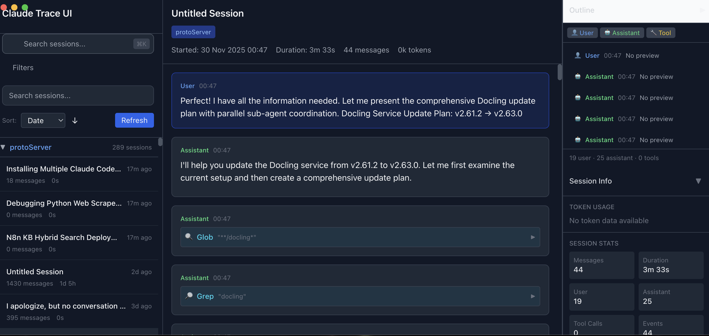

# Claude Trace UI

A desktop application for viewing and browsing Claude Code session files from `~/.claude/projects`.



## Features

- **Session Browser**: View all Claude Code sessions grouped by project
- **Session Detail**: Read full conversation history with markdown rendering
- **Code Highlighting**: Syntax highlighting for code blocks
- **Search & Filter**: Quick search across sessions
- **Project Grouping**: Collapsible project groups with session counts

## Status

**Current Phase**: Phase 3 Complete (US1 MVP)
**Bundle Size**: ~180KB (target: 200-300KB)
**Sessions Tested**: 412 sessions loaded successfully

## Tech Stack

| Layer | Technology |
|-------|-----------|
| Desktop Runtime | Electron 28+ |
| UI | Vanilla JavaScript + Tailwind CSS |
| Markdown | marked 11.x |
| Syntax Highlighting | highlight.js 11.x |
| Build | Vite 5.x + esbuild |

## Quick Start

```bash
# Install dependencies
npm install

# Start development
npm run dev:electron

# Build for production
npm run build
```

### Running from Claude Code

If running from within Claude Code (which sets `ELECTRON_RUN_AS_NODE=1`):

```bash
env -u ELECTRON_RUN_AS_NODE npm run dev:electron
```

## Project Structure

```
claude-trace-ui/
├── electron/              # Main process (Node.js)
│   ├── main.ts           # Entry, window management
│   ├── preload.ts        # IPC bridge
│   └── services/         # Session scanning, parsing
├── src/                   # Renderer (Vanilla JS)
│   ├── components/       # UI components
│   ├── services/         # IPC client, renderers
│   └── lib/              # Utilities
├── specs/                 # Feature specifications
└── .specify/             # Project memory
```

## Development

```bash
# Type checking
npm run typecheck

# Linting
npm run lint

# Format code
npm run format
```

## Roadmap

- [x] Phase 1-3: Session browsing MVP
- [ ] Phase 4: Search & filtering
- [ ] Phase 5: Keyboard navigation
- [ ] Phase 6: Session export
- [ ] Phase 7: macOS packaging (DMG distribution)
- [ ] Phase 8: Windows packaging (NSIS installer)
- [ ] Phase 9: Linux packaging (AppImage)

## License

MIT
